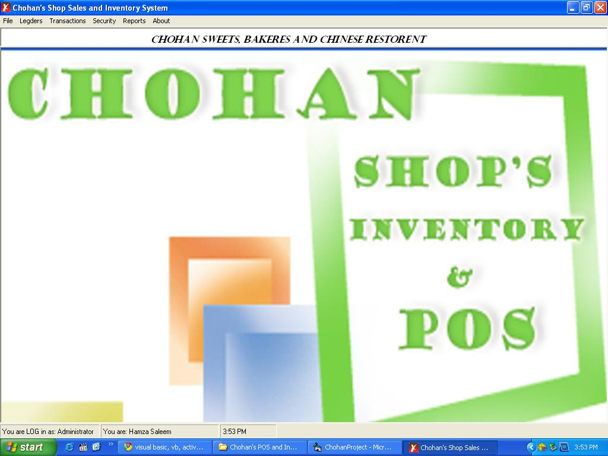



## Chohan's Shop POS and Inventory System

### Description

This Project is Created for doing an Example of All the Purposes on a Simple General Store , in this project without sales form i have used simple code . i am working on vb since 2 months and i LOVE to do VB.......So Please VOTE me for my first point of sales application......

FIRST TIME :

USERNAME: admin / user

PASSWORD: a / u
 
### More Info
 

             |
---                |---
**Submitted On**   |2010-06-06 15:54:24
**By**             |[HAmza ChohAn](https://github.com/Planet-Source-Code/PSCIndex/blob/master/ByAuthor/hamza-chohan.md)
**Level**          |Beginner
**User Rating**    |3.9 (39 globes from 10 users)
**Compatibility**  |VB 6\.0
**Category**       |[Complete Applications](https://github.com/Planet-Source-Code/PSCIndex/blob/master/ByCategory/complete-applications__1-27.md)
**World**          |[Visual Basic](https://github.com/Planet-Source-Code/PSCIndex/blob/master/ByWorld/visual-basic.md)
**Archive File**   |[Chohan's\_S218239662010\.zip](https://github.com/Planet-Source-Code/hamza-chohan-chohan-s-shop-pos-and-inventory-system__1-73192/archive/master.zip)

